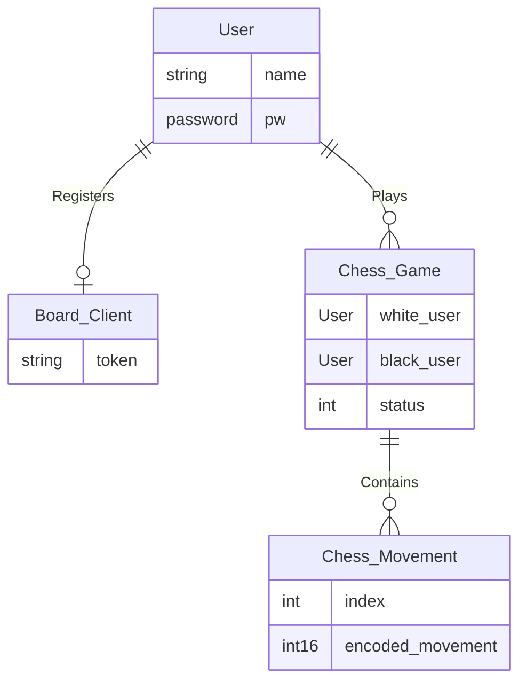

generated with mermaid.js cli tool
mmdc -i database-schema.md -o database-schema.png -t dark

if commands fails try with this
[script](https://github.com/YoAquinJs/bash-env/blob/main/bin/mmdc-compile)

```bash

mmdc-compile database-schema.md -t dark
```

Game status are: pending, draw, black won, white won


